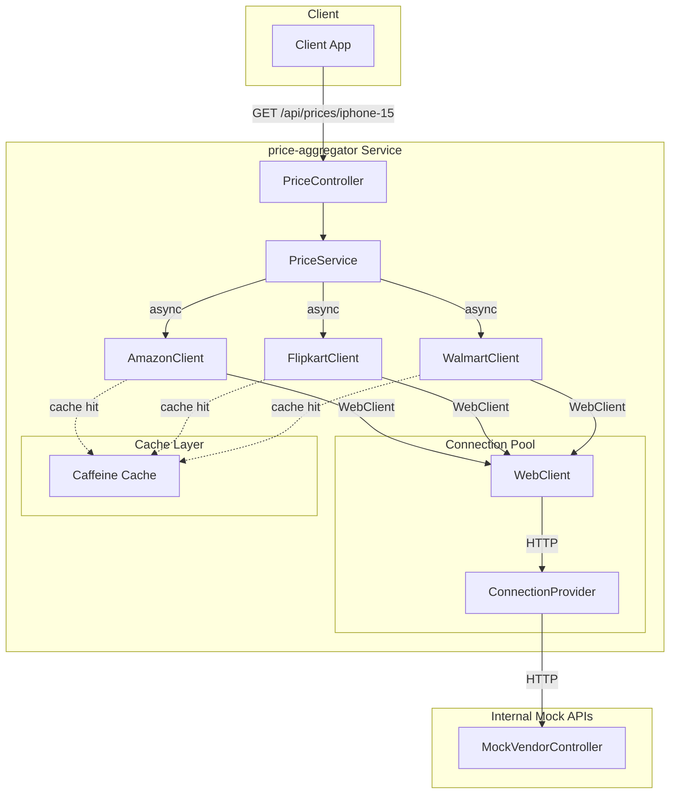
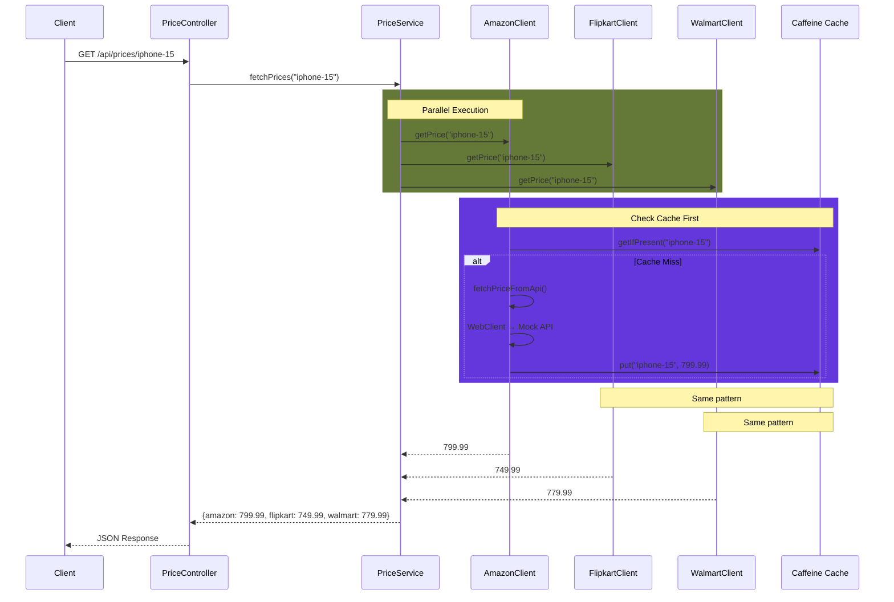

# Phase 4 — Spring Boot Aggregator

A proper Spring Boot microservice with REST API, WebClient, and connection pooling.

## Architecture



## Sequence Diagram



## Component Details

### REST Controller
- **Endpoint**: `GET /api/prices/{productId}`
- **Response**: `Map<String, Double>` - vendor name to price

### Service Layer
- Fetches prices from all vendors **in parallel**
- Uses `CompletableFuture` with thread pool
- Has **timeout** (default: 2s)
- **Fallback** to cached price on failure

### WebClient (Connection Pooling)
- **maxConnections**: 50
- **maxIdleTime**: 30s
- **maxLifeTime**: 5min
- **pendingAcquireTimeout**: 10s

### Cache (Caffeine)
- **maxSize**: 1000 entries
- **expireAfterWrite**: 10 minutes
- **recordStats**: enabled (for monitoring)

### Thread Pool
- **core-size**: 3
- **max-size**: 10
- **queue-capacity**: 100
- **thread-name-prefix**: `price-fetch-`

## Configuration

```yaml
spring:
  application:
    name: price-aggregator

server:
  port: 8080

vendors:
  amazon:
    base-url: http://localhost:8080
  flipkart:
    base-url: http://localhost:8080
  walmart:
    base-url: http://localhost:8080
  connection-timeout-ms: 5000
  read-timeout-ms: 5000
  cache:
    max-size: 1000
    expire-after-write-minutes: 10

price:
  fetch:
    timeout-ms: 2000
  pool:
    core-size: 3
    max-size: 10
    queue-capacity: 100
    thread-name-prefix: price-fetch-
```

## API Endpoints

| Method | Endpoint | Description |
|--------|----------|-------------|
| GET | `/api/prices/{productId}` | Fetch prices from all vendors |
| GET | `/mock-api/amazon/{productId}` | Mock Amazon API |
| GET | `/mock-api/flipkart/{productId}` | Mock Flipkart API |
| GET | `/mock-api/walmart/{productId}` | Mock Walmart API |

## Testing with cURL

### 1. Fetch all prices for a product

```bash
curl -s http://localhost:8080/api/prices/iphone-15 | jq
```

**Response:**
```json
{
  "amazon": 799.99,
  "flipkart": 749.99,
  "walmart": 779.99
}
```

### 2. Test mock vendor APIs

```bash
# Amazon
curl -s http://localhost:8080/mock-api/amazon/iphone-15 | jq

# Flipkart
curl -s http://localhost:8080/mock-api/flipkart/iphone-15 | jq

# Walmart
curl -s http://localhost:8080/mock-api/walmart/iphone-15 | jq
```

**Response:**
```json
{
  "productId": "iphone-15",
  "price": 799.99,
  "vendor": "amazon",
  "timestamp": 1713244800000
}
```

### 3. Test with different products

```bash
curl -s http://localhost:8080/api/prices/macbook-pro | jq
curl -s http://localhost:8080/api/prices/airpods-pro | jq
curl -s http://localhost:8080/api/prices/ipad-mini | jq
```

### 4. Test timeout behavior

```bash
time curl -s http://localhost:8080/api/prices/timeout-test
```

### 5. Test cache behavior (second call should be faster)

```bash
# First call (cache miss)
time curl -s http://localhost:8080/api/prices/iphone-15 > /dev/null

# Second call (cache hit)
time curl -s http://localhost:8080/api/prices/iphone-15 > /dev/null
```

## Running

```bash
./gradlew bootRun
```

## Verification

```bash
# Check service is running
curl -s http://localhost:8080/actuator/health

# Fetch prices
curl -s http://localhost:8080/api/prices/test-product
```