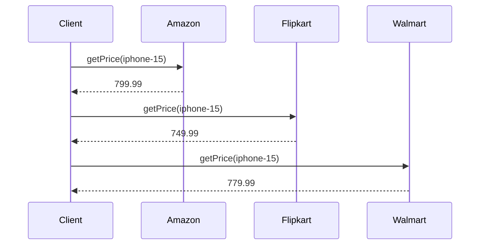
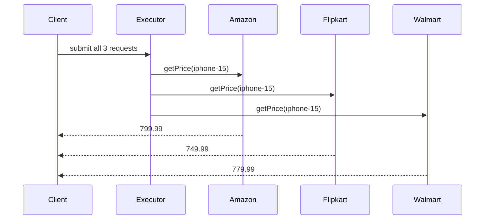
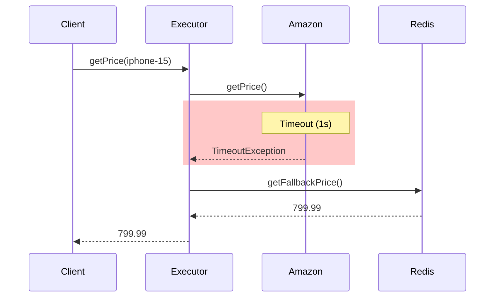

# Part 1 — Basic Price Fetching (Phases 1-3)

Implementation of price fetching using different phases of optimization.

## Phase 1 — Sequential Fetching

Fetch prices from each vendor one by one:

```java
double amazonPrice = amazon.getPrice(productId);     
double flipkartPrice = flipkart.getPrice(productId);   
double walmartPrice = walmart.getPrice(productId);     
// Total: ~300-3000ms
```



## Phase 2 — Parallel Fetching

Fetch from all vendors simultaneously using threads:

```java
ExecutorService executor = Executors.newFixedThreadPool(3);

CompletableFuture<Double> amazonFuture = CompletableFuture
        .supplyAsync(() -> amazon.getPrice(productId), executor);
CompletableFuture<Double> flipkartFuture = CompletableFuture
        .supplyAsync(() -> flipkart.getPrice(productId), executor);
CompletableFuture<Double> walmartFuture = CompletableFuture
        .supplyAsync(() -> walmart.getPrice(productId), executor);

CompletableFuture.allOf(amazonFuture, flipkartFuture, walmartFuture).join();
// Total: ~100-1000ms (max of all)
```



## Phase 3 — Handling Vendor Failures

Add timeout and fallback on failure:

```java
CompletableFuture<Double> amazonPrice = CompletableFuture
        .supplyAsync(() -> amazon.getPrice(productId), executor)
        .orTimeout(1000, TimeUnit.MILLISECONDS)
        .exceptionally(ex -> amazon.getFallbackPrice(productId));
```



## Comparison

| Phase | Description | Time | Failure Handling |
|-------|------------|------|--------------|
| 1 | Sequential | ~300-3000ms | None |
| 2 | Parallel | ~100-1000ms | Manual |
| 3 | Parallel + Timeout | ~100-1000ms | Automatic Fallback |

## Next Steps

- [Part2](Part2.md) — Spring Boot Aggregator with REST API