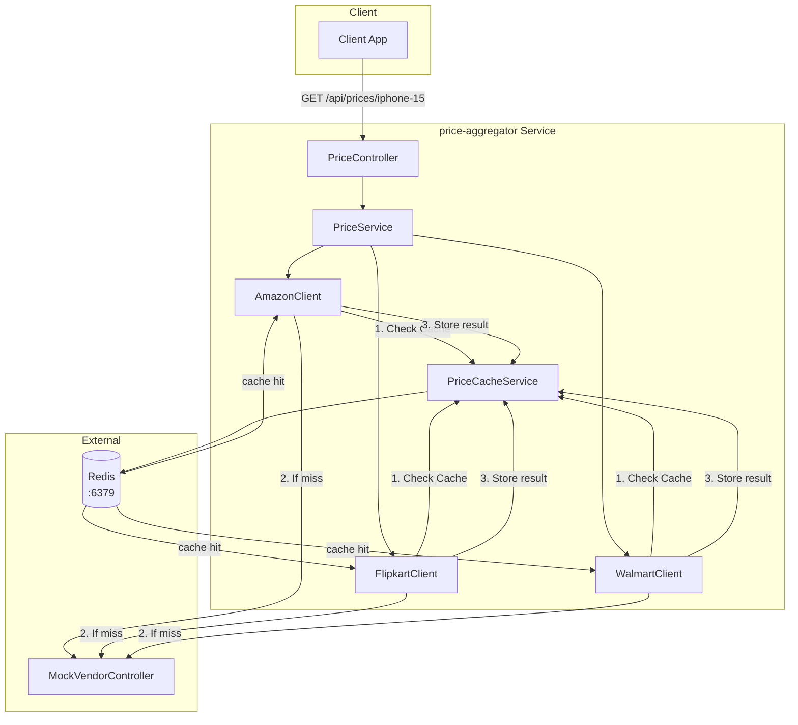
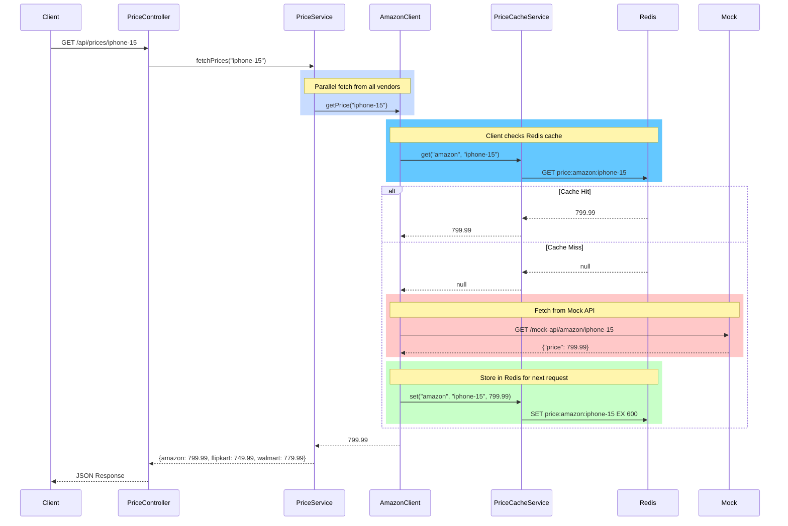

# Part 3 — Redis Caching Layer

Now vendor APIs are expensive and slow. Cache results in Redis to improve performance.

## Architecture



## Flow



## Implementation

### Redis Configuration

```yaml
spring:
  data:
    redis:
      host: ${SPRING_DATA_REDIS_HOST:localhost}
      port: ${SPRING_DATA_REDIS_PORT:6379}
      timeout: 5000ms
      lettuce:
        pool:
          max-active: 50
          max-idle: 20
          min-idle: 5
          max-wait: 3000ms
```

### Cache Service (PriceCacheService)

| Method | Description |
|-------|-------------|
| `get(vendor, productId)` | Get cached price from Redis |
| `set(vendor, productId, price)` | Store price with TTL |
| `evict(vendor, productId)` | Invalidate cache entry |

### Key Format

```
price:{vendor}:{productId} → {price}
```

Example:
```
price:amazon:iphone-15 → 799.99
price:flipkart:iphone-15 → 749.99
price:walmart:iphone-15 → 779.99
```

## Docker Setup

### docker-compose.yml

```yaml
services:
  redis:
    image: redis:7-alpine
    container_name: price-aggregator-redis
    ports:
      - "6379:6379"
    volumes:
      - redis-data:/data
    command: redis-server --appendonly yes
    healthcheck:
      test: ["CMD", "redis-cli", "ping"]
      interval: 10s
      timeout: 5s
      retries: 5

  app:
    build:
      context: .
      dockerfile: Dockerfile
    container_name: price-aggregator-app
    ports:
      - "8080:8080"
    environment:
      - SPRING_PROFILES_ACTIVE=prod
      - SPRING_DATA_REDIS_HOST=redis
      - SPRING_DATA_REDIS_PORT=6379
    depends_on:
      redis:
        condition: service_healthy

volumes:
  redis-data:
```

### Dockerfile

```dockerfile
FROM eclipse-temurin:25-jdk AS builder
WORKDIR /app
COPY . .
RUN ./gradlew bootJar --no-daemon

FROM eclipse-temurin:25-jre-alpine
WORKDIR /app
COPY --from=builder /app/build/libs/*.jar app.jar
EXPOSE 8080
ENV JAVA_OPTS="-Xms256m -Xmx512m"
ENTRYPOINT ["sh", "-c", "java $JAVA_OPTS -jar app.jar"]
```

## Running

### Development (local)

```bash
./gradlew bootRun
```

### Production (Docker)

```bash
docker-compose up --build
```

## Testing

### 1. Start services

```bash
docker-compose up -d
```

### 2. Connect to Redis CLI

#### Option A: Using docker exec

```bash
docker exec -it price-aggregator-redis redis-cli
```

Inside the CLI:

```
PING
KEYS *
EXIT
```

#### Option B: Quick one-liner commands

```bash
# Ping Redis
docker exec -it price-aggregator-redis redis-cli PING

# List all keys
docker exec -it price-aggregator-redis redis-cli KEYS "price:*"

# Get a value
docker exec -it price-aggregator-redis redis-cli GET price:amazon:iphone-15
```

#### Option C: Connect from host

```bash
redis-cli -h localhost -p 6379
```

### 3. Test API

```bash
curl http://localhost:8080/api/prices/iphone-15
```

### 4. Verify cache in Redis

```bash
docker exec -it price-aggregator-redis redis-cli KEYS "price:*"
```

Expected:
```
1) "price:amazon:iphone-15"
2) "price:flipkart:iphone-15"
3) "price:walmart:iphone-15"
```

### 5. Get cached value

```bash
docker exec -it price-aggregator-redis redis-cli GET price:amazon:iphone-15
```

### 6. Check TTL

```bash
docker exec -it price-aggregator-redis redis-cli TTL price:amazon:iphone-15
```

### 7. Delete cached values

```bash
# Delete single key
docker exec -it price-aggregator-redis redis-cli DEL price:amazon:iphone-15

# Delete all price keys
docker exec -it price-aggregator-redis redis-cli FLUSHDB
```

### 8. Stop and cleanup

```bash
docker-compose down
docker-compose down -v
```

## Redis CLI Commands Reference

| Command | Description |
|---------|-------------|
| `PING` | Check connection |
| `KEYS pattern` | Find keys |
| `GET key` | Get value |
| `SET key value` | Set value |
| `SET key value EX seconds` | Set with TTL |
| `TTL key` | Get time until expiry |
| `DEL key` |_delete key |
| `FLUSHDB` | Delete all keys |
| `INFO` | Server info |

## Benefits

| Metric | Before | After |
|--------|--------|-------|
| Latency | 100-500ms | 5-20ms (cache hit) |
| API calls | Every request | Only on cache miss |

## Next Steps

- [Part4](Part4.md) — Rate Limiting + Bulkheads (Resilience4j)