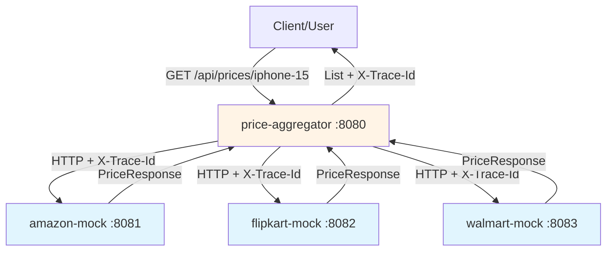
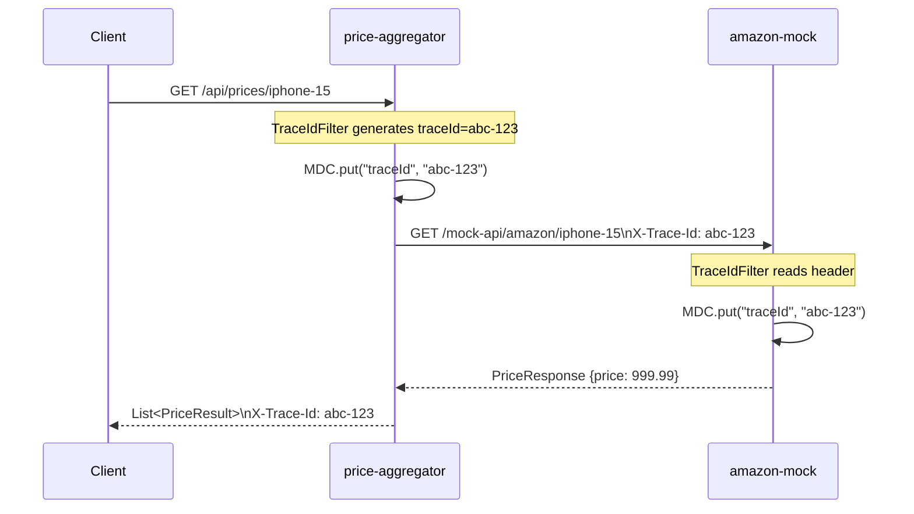

# Part 6 — Mock Services Refactoring (Distributed Architecture)

## Overview

This phase refactors the monolithic price-aggregator by **extracting mock vendor APIs** into standalone Spring Boot microservices. This creates a true distributed architecture where each vendor mock runs as an independent service.

## Why Refactor to Separate Services?

### Before (Monolithic)
```
price-aggregator (port 8080)
├── PriceController
├── AmazonClient → MockVendorController (same app)
├── FlipkartClient → MockVendorController (same app)
└── WalmartClient → MockVendorController (same app)
```

**Problems:**
- No real network calls (same JVM)
- Can't test true distributed tracing
- Can't simulate real network failures
- All services share same resources

### After (Distributed)
```
amazon-mock (port 8081)     ← Standalone service
flipkart-mock (port 8082) ← Standalone service
walmart-mock (port 8083)  ← Standalone service
price-aggregator (port 8080) ← Calls external services via HTTP
```

**Benefits:**
- ✅ True HTTP calls across network
- ✅ Real distributed tracing (traceId propagates via headers)
- ✅ Test network failures, timeouts, chaos
- ✅ Independent scaling and deployment
- ✅ Each service has its own resources (thread pools, memory)

---

## Mock Service Minimal Features

Each mock service implements **11 minimal features**:

### Core Features (MUST HAVE)

| # | Feature | Implementation |
|---|---------|---------------|
| 1 | **REST Endpoint** | `GET /mock-api/{vendor}/{productId}` returns `PriceResponse` |
| 2 | **Price Generation** | Random price (100-1000) with timestamp |
| 3 | **TraceId Propagation** | Read `X-Trace-Id` header, set MDC, return in response |
| 4 | **Structured Logging** | `logback-spring.xml` with `[thread][app-name][traceId]` pattern |
| 5 | **Health Endpoint** | Spring Actuator `/actuator/health` for monitoring |

### Chaos Features (for Resilience4j Testing)

| # | Feature | Implementation |
|---|---------|---------------|
| 6 | **Chaos State Storage** | In-memory (`AtomicBoolean`, `AtomicInteger`) |
| 7 | **Chaos Endpoints** | `/mock-api/chaos/enable`, `/disable`, `/reset`, `/status` |
| 8 | **Predefined Scenarios** | `/chaos/scenario/fast-failures`, `/slow-responses`, `/unstable` |

### Configuration

| # | Feature | Implementation |
|---|---------|---------------|
| 9 | **Unique Port** | amazon-mock:8081, flipkart-mock:8082, walmart-mock:8083 |
| 10 | **Application Name** | `spring.application.name=amazon-mock` (for logs) |
| 11 | **Server Config** | `server.port`, minimal `application.yaml` |

---

## GitHub Repositories

Each mock service is a separate GitHub repository:

| Service | GitHub URL | Port |
|---------|------------|------|
| **amazon-mock** | [github.com/code-farm0/amazon-mock](https://github.com/code-farm0/amazon-mock) | 8081 |
| **flipkart-mock** | [github.com/code-farm0/flipkart-mock](https://github.com/code-farm0/flipkart-mock) | 8082 |
| **walmart-mock** | [github.com/code-farm0/walmart-mock](https://github.com/code-farm0/walmart-mock) | 8083 |

**Main Aggregator:**
| Service | GitHub URL | Port |
|---------|------------|------|
| **price-aggregator** | [github.com/code-farm0/price-aggregator](https://github.com/code-farm0/price-aggregator) | 8080 |

---

## Architecture Diagram



---

## Project Structure

### amazon-mock/
```
amazon-mock/
├── src/main/java/in/codefarm/amazon/mock/
│   ├── AmazonMockApplication.java
│   ├── controller/
│   │   └── AmazonMockController.java    # /mock-api/amazon/{productId}
│   ├── config/
│   │   └── TraceIdFilter.java            # MDC + X-Trace-Id
│   ├── dto/
│   │   └── PriceResponse.java           # {productId, price, timestamp}
│   └── service/
│       └── PriceCacheService.java       # Optional caching
├── src/main/resources/
│   ├── application.yaml               # Port 8081, app name
│   └── logback-spring.xml            # Structured logging
├── build.gradle
└── settings.gradle
```

**flipkart-mock/** and **walmart-mock/** follow identical structure.

### price-aggregator/ (Updated)
```
price-aggregator/
├── src/main/java/in/codefarm/price/aggregator/
│   ├── controller/PriceController.java
│   ├── external/
│   │   ├── AmazonClient.java        # Calls http://localhost:8081
│   │   ├── FlipkartClient.java     # Calls http://localhost:8082
│   │   └── WalmartClient.java      # Calls http://localhost:8083
│   └── config/WebClientConfig.java  # Propagates X-Trace-Id header
└── src/main/resources/application.yaml
```

---

## Configuration Changes

### price-aggregator (application.yaml)

```yaml
vendors:
  amazon:
    base-url: http://localhost:8081   # Points to amazon-mock
  flipkart:
    base-url: http://localhost:8082   # Points to flipkart-mock
  walmart:
    base-url: http://localhost:8083   # Points to walmart-mock
```

### amazon-mock (application.yaml)

```yaml
spring:
  application:
    name: amazon-mock

server:
  port: 8081

management:
  endpoints:
    web:
      exposure:
        include: health
```

**flipkart-mock** uses port 8082, **walmart-mock** uses port 8083.

---

## TraceId Propagation (End-to-End)



**Key:** `X-Trace-Id` header propagates through:
1. Client → price-aggregator (generated)
2. price-aggregator → mock services (via WebClient header)
3. Mock services read and log it

---

## Chaos Testing (Distributed)

Since each mock is standalone, chaos endpoints work exactly as before:

```bash
# Test amazon-mock
curl http://localhost:8081/mock-api/chaos/scenario/fast-failures
curl http://localhost:8081/mock-api/chaos/scenario/slow-responses
curl http://localhost:8081/mock-api/chaos/scenario/unstable

# Observe circuit breaker in price-aggregator
./cb-test.sh watch
```

**Difference:** Now there's a **real network call** between services, so:
- Timeouts are real (network latency)
- Chaos scenarios affect actual HTTP connections
- Circuit breaker behavior is more realistic

---

## How to Run (Distributed Mode)

### Terminal 1: Start amazon-mock
```bash
cd amazon-mock
./gradlew bootRun  # Runs on port 8081
```

### Terminal 2: Start flipkart-mock
```bash
cd flipkart-mock
./gradlew bootRun  # Runs on port 8082
```

### Terminal 3: Start walmart-mock
```bash
cd walmart-mock
./gradlew bootRun  # Runs on port 8083
```

### Terminal 4: Start price-aggregator
```bash
cd price-aggregator
./gradlew bootRun  # Runs on port 8080
```

### Test the distributed setup
```bash
curl -v http://localhost:8080/api/prices/iphone-15
# Check X-Trace-Id header in response
# Check logs in all 4 terminals - same traceId!
```

---

## Key Takeaways

✅ **True distributed architecture** — separate JVMs, real HTTP calls

✅ **Minimal mock services** — just 11 features per service

✅ **TraceId propagates end-to-end** via `X-Trace-Id` header

✅ **Chaos testing works** across network boundaries

✅ **Independent repositories** — each service can be developed/deployed separately

✅ **Realistic resilience testing** — network failures, timeouts, circuit breakers

---

## Comparison: Monolithic vs Distributed

| Aspect | Monolithic (Before) | Distributed (After) |
|--------|-------------------|-------------------|
| **Mock APIs** | Same app (price-aggregator) | Separate services |
| **Calls** | Internal method calls | HTTP requests |
| **Tracing** | Same JVM (easier) | Cross-network (realistic) |
| **Failures** | Simulated only | Real network issues |
| **Scaling** | Single deployment | Independent scaling |
| **Testing** | Limited realism | True distributed testing |

---

## Next Steps

With distributed architecture in place:

- **Part 7:** Unit Tests (mock services + aggregator)
- **Part 8:** Integration Tests (test across services)
- **Part 9:** Load Testing (distributed load)
- **Part 10:** Event-Driven Updates (Kafka between services)
- **Part 11:** Micrometer Observability (distributed metrics)
- **Part 12:** ELK Stack (centralized logging across services)

---

## References

**GitHub Repositories:**
- [price-aggregator](https://github.com/code-farm0/price-aggregator)
- [amazon-mock](https://github.com/code-farm0/amazon-mock)
- [flipkart-mock](https://github.com/code-farm0/flipkart-mock)
- [walmart-mock](https://github.com/code-farm0/walmart-mock)

**Related Documentation:**
- [Part 4: Circuit Breaker](Part4.md)
- [Part 5: TraceId & Logging](medium-stories/01-thread-pool-mdc-propagation.md)
- [Medium Story: Resilience4j Patterns](medium-stories/02-resilience-circuit-breaker.md)
