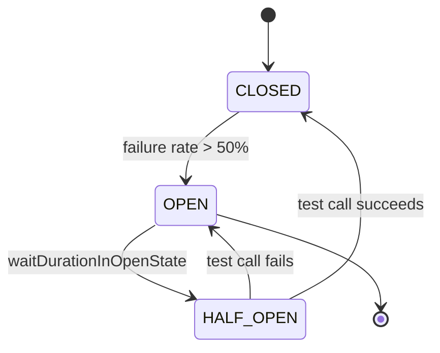
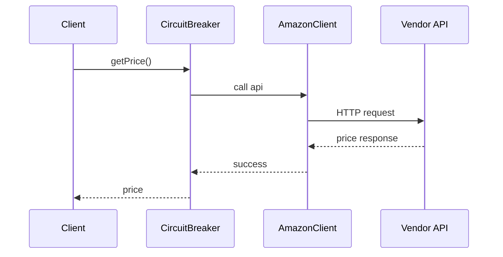
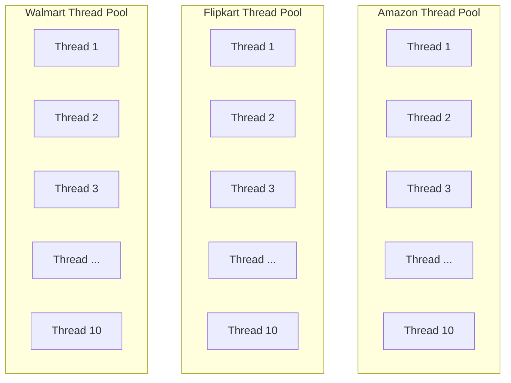
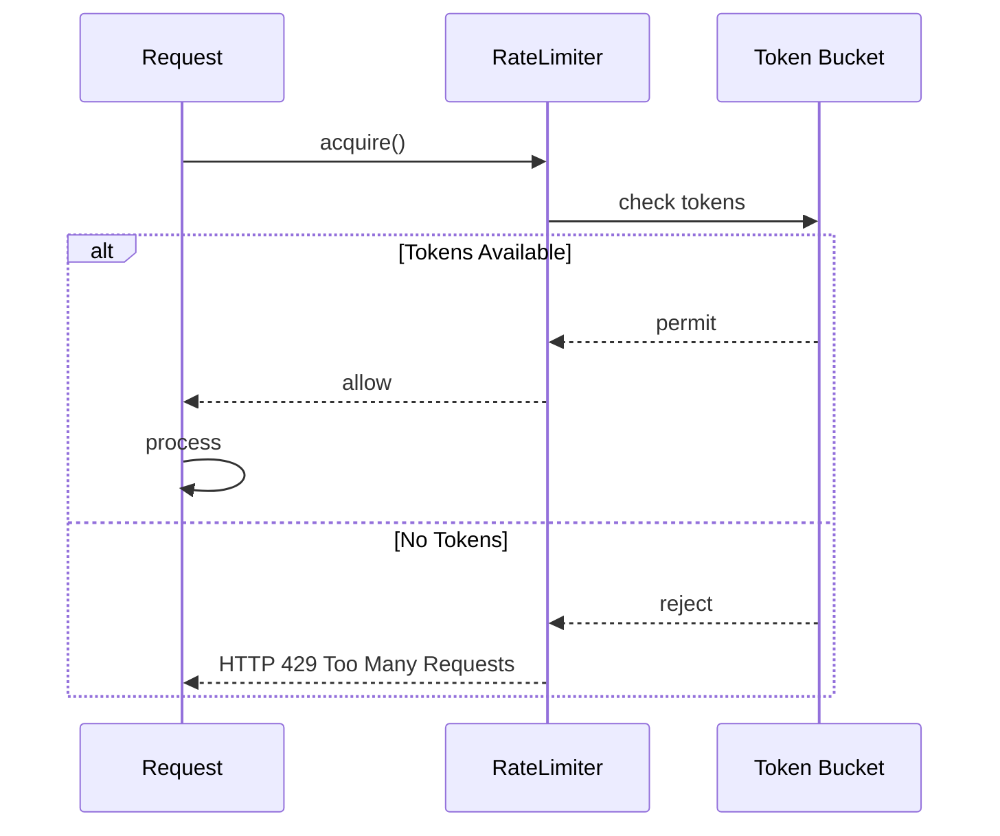

# Part 4 — Circuit Breaker (Resilience4j)

Vendor APIs can fail. We use Resilience4j Circuit Breaker to handle failures gracefully.

## Problem Statement

- Vendor APIs limit requests per second/minute
- One slow vendor can consume all threads
- Vendor failures should not cascade to other vendors

## Techniques

### 1. Circuit Breaker



When CLOSED, requests flow through to the client:



States:
- **CLOSED**: Normal operation, requests pass through to client
- **OPEN**: Too many failures, reject requests immediately
- **HALF-OPEN**: Test if vendor is recovered

### 2. Bulkhead Pattern

Isolate each vendor's thread pool:



Each vendor gets **10 isolated threads** - one slow vendor doesn't affect others.

### 3. Rate Limiting



## Architecture with Resilience4j

```mermaid
graph TD
    subgraph Client
        C[Client App]
    end

    subgraph "price-aggregator Service"
        PC[PriceController]
        PS[PriceService]
        
        subgraph "Amazon Resilience"
            AC[AmazonClient]
            CB_A[CircuitBreaker]
            BL_A[Bulkhead]
            RL_A[RateLimiter]
        end
        
        subgraph "Flipkart Resilience"
            FC[FlipkartClient]
            CB_F[CircuitBreaker]
            BL_F[Bulkhead]
            RL_F[RateLimiter]
        end
        
        subgraph "Walmart Resilience"
            WC[WalmartClient]
            CB_W[CircuitBreaker]
            BL_W[Bulkhead]
            RL_W[RateLimiter]
        end
    end

    C -->|GET /api/prices/iphone-15| PC
    PC --> PS
    PS --> AC
    PS --> FC
    PS --> WC
    
    AC --> CB_A
    FC --> CB_F
    WC --> CB_W
    
    CB_A --> BL_A
    CB_F --> BL_F
    CB_W --> BL_W
    
    BL_A --> RL_A
    BL_F --> RL_F
    BL_W --> RL_W
    
    RL_A -->|HTTP| MockA[Mock API]
    RL_F -->|HTTP| MockF[Mock API]
    RL_W -->|HTTP| MockW[Mock API]
```



## Configuration

### Circuit Breaker

```yaml
resilience4j:
  circuitbreaker:
    instances:
      amazon:
        registerHealthIndicator: true
        slidingWindowSize: 10
        minimumNumberOfCalls: 5
        permittedNumberOfCallsInHalfOpenState: 3
        automaticTransitionFromOpenToHalfOpenEnabled: true
        waitDurationInOpenState: 5s
        failureRateThreshold: 50
```

### Bulkhead

```yaml
resilience4j:
  bulkhead:
    instances:
      amazon:
        maxConcurrentCalls: 10
        maxWaitDuration: 1000ms
```

### Rate Limiter

```yaml
resilience4j:
  ratelimiter:
    instances:
      amazon:
        limitForPeriod: 100
        limitRefreshPeriod: 1s
        timeoutDuration: 100ms
```

## Dependencies

```groovy
plugins {
    id 'org.springframework.boot' version '4.0.6'
    id 'io.spring.dependency-management' version '1.1.7'
}

repositories {
    mavenCentral()
    maven { url 'https://central.sonatype.com/repository/maven-snapshots' }
}

dependencies {
    implementation 'org.springframework.boot:spring-boot-starter-webmvc'
    implementation 'org.springframework.boot:spring-boot-starter-webflux'
    implementation 'org.springframework.boot:spring-boot-starter-data-redis'
    implementation 'org.springframework.boot:spring-boot-starter-actuator'
    implementation 'io.github.resilience4j:resilience4j-spring-boot4:2.3.1-SNAPSHOT'
}
```

## Implementation

### Programmatic Circuit Breaker (Working Approach)

Using Resilience4j's CircuitBreaker directly in vendor clients:

```java
@Component
public class AmazonClient implements PriceAggregator {

    private final CircuitBreaker circuitBreaker;

    public AmazonClient(CircuitBreakerRegistry circuitBreakerRegistry) {
        this.circuitBreaker = circuitBreakerRegistry.circuitBreaker("amazon");
        this.circuitBreaker.getEventPublisher()
            .onStateTransition(event -> log.info("Circuit state: {} -> {}", ...))
            .onError(event -> log.warn("Circuit: call failed"));
    }

    @Override
    public double getPrice(String productId) {
        Supplier<PriceResponse> supplier = () -> webClient.get()
            .uri("/mock-api/amazon/{productId}", productId)
            .retrieve().bodyToMono(PriceResponse.class)
            .timeout(Duration.ofSeconds(3)).block();

        try {
            return circuitBreaker.executeSupplier(supplier).getPrice();
        } catch (Exception e) {
            return getFallbackPrice(productId, e);
        }
    }
}
```

### What Was Done

- [x] Add Resilience4j Spring Boot 4 dependency (uses snapshot for SB 4 support)
- [x] Configure CircuitBreaker instances in application.yaml
- [x] Implement programmatic circuit breaker with CircuitBreakerRegistry
- [x] Configure actuator endpoints for circuit breaker health
- [x] Add circuit breaker event logging
- [x] Add chaos endpoints to simulate failures/slow calls
- [x] Enhanced API response with `PriceResult` DTO
- [x] Support `X-Refresh-Cache` header for cache control
- [x] MDC traceId propagation with `MdcTaskDecorator`
- [x] Proper error responses with HTTP 207 for all-failures
- [x] Structured logging with `[VENDOR]` prefix and traceId
- [x] **FIXED** - `traceId` in response header `X-Trace-Id` (not in JSON body - uses `@JsonIgnore`)
- [x] **FIXED** - `source` field now correctly shows `CACHE`/`API`/`FALLBACK`
- [x] **FIXED** - Controller cleaned up (no MDC logic, all in TraceIdFilter)
- [x] **FIXED** - PriceCacheService stores `PriceResult` as JSON with proper `source`

## API Response Format

### Response Header

The `X-Trace-Id` header is included in ALL responses (set by `TraceIdFilter`):
```
X-Trace-Id: a1b2c3d4-e5f6-7890-abcd-ef1234567890
```

### New Response Structure (List<PriceResult>)

```json
[
  {
    "vendor": "amazon",
    "price": 999.99,
    "timestamp": 1777198215258,
    "source": "CACHE",
    "error": null
  },
  {
    "vendor": "flipkart",
    "price": null,
    "timestamp": null,
    "source": "FALLBACK",
    "error": "No price available"
  }
]
```

Note: `traceId` is NOT in the JSON body - it's in the `X-Trace-Id` response header.

### Source Enum Values

| Value | Meaning |
|-------|---------|
| `CACHE` | Price from Redis cache |
| `API` | Fresh from 3rd party API |
| `FALLBACK` | Fallback when API fails (may be from cache) |

### Cache Control Header

```bash
# Use cache if available (default)
curl http://localhost:8080/api/prices/iphone-15

# Force fresh API call (skip cache read)
curl -H "X-Refresh-Cache: true" http://localhost:8080/api/prices/iphone-15
```

### Error Handling

When ALL vendors fail, API returns **HTTP 207 (Multi-Status)** with error details:
```json
[
  {
    "vendor": "amazon",
    "price": null,
    "error": "No price available",
    "source": "FALLBACK"
  }
]
```

## MDC TraceId Propagation

### How It Works

1. **TraceIdFilter** intercepts all requests
2. Generates/reads `X-Trace-Id` header, sets response header
3. Sets `MDC.put("traceId", traceId)` for logging
4. **MdcTaskDecorator** propagates MDC to async threads via `priceTaskExecutor`
5. **WebClient** propagates `X-Trace-Id` header to 3rd party APIs via `ExchangeFilterFunction`
6. All logs across controller → service → clients → 3rd party show same `traceId`
7. `traceId` is returned in **response header** `X-Trace-Id` (NOT in JSON body)

### Structured Logging Format

Configured in `logback-spring.xml` - format: `timestamp [thread][app-name][traceId] level logger - message`:

```xml
<property name="LOG_PATTERN" value="%d{yyyy-MM-dd HH:mm:ss.SSS} [%thread][%property{app-name}][traceId=%X{traceId:-N/A}] %-5level %logger{36} - %msg%n"/>
```

Example output (traceId appears ONLY in pattern, NOT duplicated in message):
```
2026-04-28 10:00:00.123 [http-nio-8080-exec-1][price-aggregator][traceId=abc-123] INFO  c.c.p.a.controller.PriceController - GET /api/prices/iphone-15 refreshCache=false
2026-04-28 10:00:00.456 [price-fetch-1][price-aggregator][traceId=abc-123] INFO  c.c.p.a.external.AmazonClient - [AMAZON] productId=iphone-15 source=API price=999.99
2026-04-28 10:00:00.789 [price-fetch-2][price-aggregator][traceId=abc-123] WARN  c.c.p.a.external.FlipkartClient - [FLIPKART] circuit breaker triggered
2026-04-28 10:00:01.012 [mock-api-1][price-aggregator][traceId=abc-123] INFO  c.c.p.a.mock.MockVendorController - [MOCK-AMAZON] productId=iphone-15
```

### TraceId Propagation to 3rd Party

WebClient configured with `ExchangeFilterFunction` that adds `X-Trace-Id` header to outgoing requests:

```java
// WebClientConfig.java
private ExchangeFilterFunction traceIdPropagationFilter() {
    return ExchangeFilterFunction.ofRequestProcessor(request -> {
        String traceId = MDC.get("traceId");
        if (traceId != null && !traceId.isEmpty()) {
            ClientRequest newRequest = ClientRequest.from(request)
                    .header(TRACE_ID_HEADER, traceId)
                    .build();
            return Mono.just(newRequest);
        }
        return Mono.just(request);
    });
}
```

### Response Header

```
X-Trace-Id: abc-123-def-456...
```

The `traceId` field in `PriceResult` is marked `@JsonIgnore` so it doesn't appear in the JSON body.

### Configuration

**MdcTaskDecorator** (in `PriceConfig.java`):
```java
@Bean(name = "priceTaskExecutor")
public Executor priceTaskExecutor() {
    ThreadPoolTaskExecutor executor = new ThreadPoolTaskExecutor();
    // ... other config ...
    executor.setTaskDecorator(new MdcTaskDecorator()); // MDC propagation
    executor.initialize();
    return executor;
}
```

## How Circuit Breaker Works

1. Client calls vendor API method
2. `circuitBreaker.executeSupplier()` wraps the API call
3. Circuit breaker tracks success/failure:
   - If >50% failures in 10 calls → circuit OPENS
4. When OPEN:
   - Subsequent calls are rejected immediately (`notPermittedCalls` increments)
   - Fallback method returns cached value
5. After 5s wait → circuit goes to HALF_OPEN
6. 3 test calls are permitted
7. If test calls succeed → circuit CLOSES
8. If test calls fail → circuit re-OPENS

### Monitoring

Check circuit breaker status:
```bash
curl http://localhost:8080/actuator/health
```

View all circuit breakers:
```bash
curl http://localhost:8080/actuator/circuitbreakers
```

## Testing Circuit Breakers

Use the chaos endpoints and test script to simulate failures and observe circuit behavior.

### Chaos API Endpoints

```bash
# Check current chaos status
curl http://localhost:8080/mock-api/chaos/status

# Enable chaos mode (custom settings)
curl "http://localhost:8080/mock-api/chaos/enable?failureRate=70&delay=3000"

# Disable chaos mode
curl http://localhost:8080/mock-api/chaos/disable

# Pre-configured scenarios
curl http://localhost:8080/mock-api/chaos/scenario/fast-failures   # 100% failures (50ms delay)
curl http://localhost:8080/mock-api/chaos/scenario/slow-responses  # 500ms delay (exceeds 100ms threshold)
curl http://localhost:8080/mock-api/chaos/scenario/unstable         # 70% fail + 3s delay
```

### Test Script

```bash
./cb-test.sh help              # Show usage
./cb-test.sh reset             # Reset chaos state
./cb-test.sh fast-fail         # Trip circuit with 100% failures
./cb-test.sh slow              # Test slow call threshold
./cb-test.sh unstable          # Trip circuit with 70% failures
./cb-test.sh observe           # Normal calls
./cb-test.sh watch             # Real-time monitoring
```

### Step-by-Step Testing

**1. Reset and Start Fresh**
```bash
./cb-test.sh reset
```

**2. Fast Failures → OPEN**
```bash
./cb-test.sh fast-fail
# Observe: After 6 failures in 10 calls, circuit opens
# State changes to OPEN
```

**3. Wait for HALF_OPEN**
```bash
# After 5 seconds in OPEN state
sleep 6
./cb-test.sh watch
# Observe: State changes to HALF_OPEN
```

**4. Recovery or Re-OPEN**
```bash
# If test calls succeed → CLOSED
# If test calls fail → back to OPEN
./cb-test.sh observe
```

**5. Slow Calls**
```bash
./cb-test.sh slow
# With slowCallDurationThreshold: 100ms
# After 5 slow calls out of 10, circuit opens
```