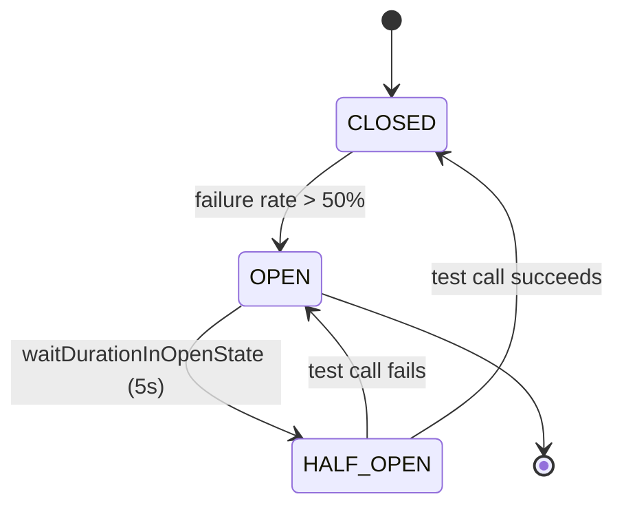
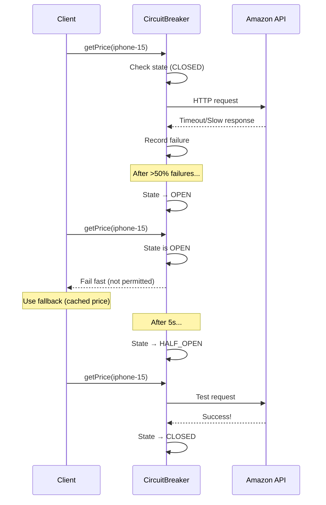
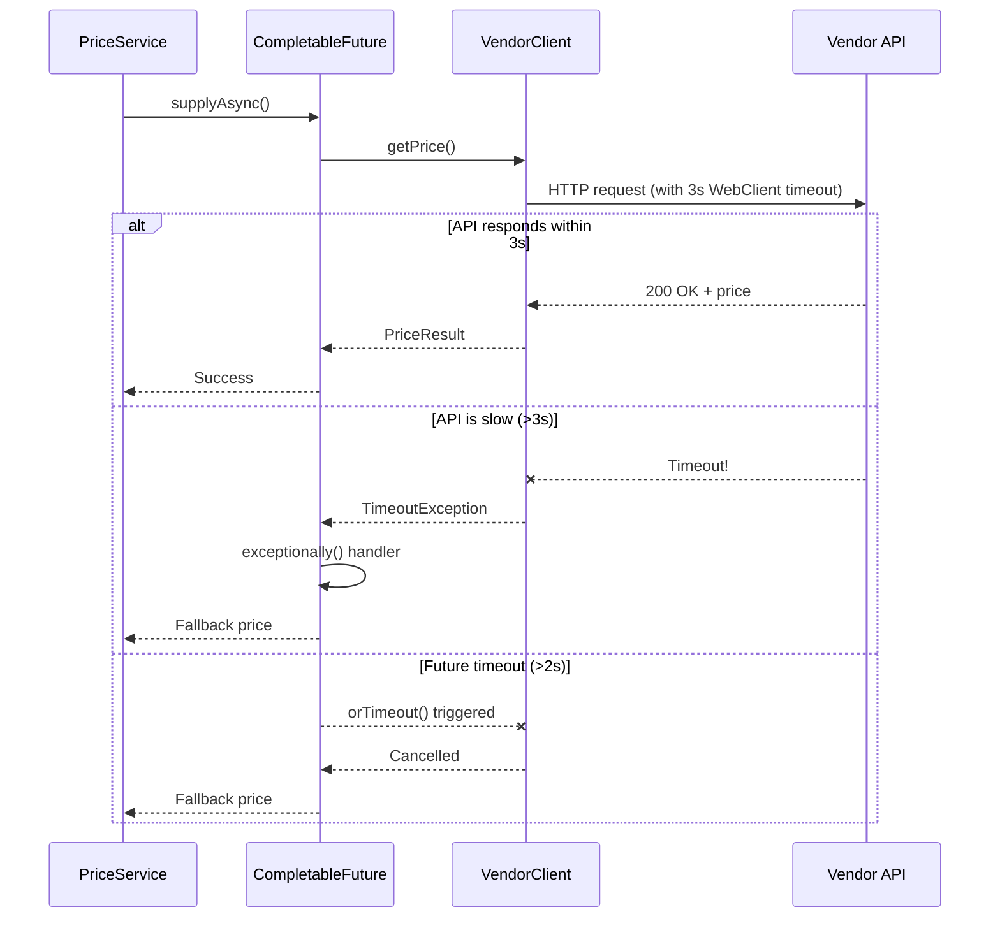
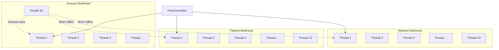
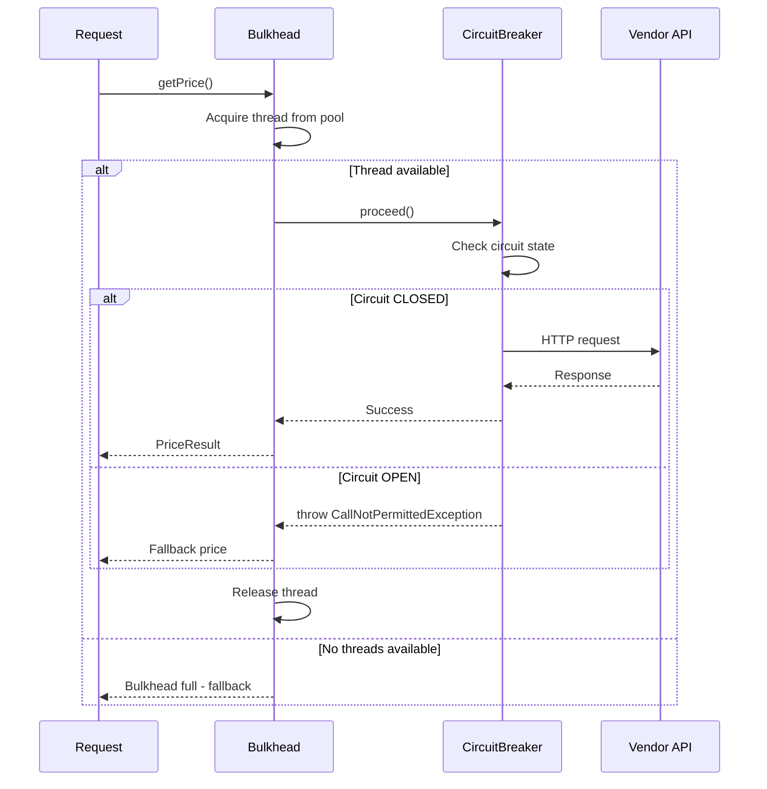
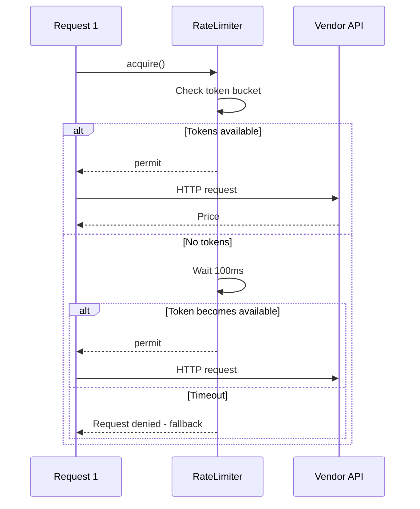
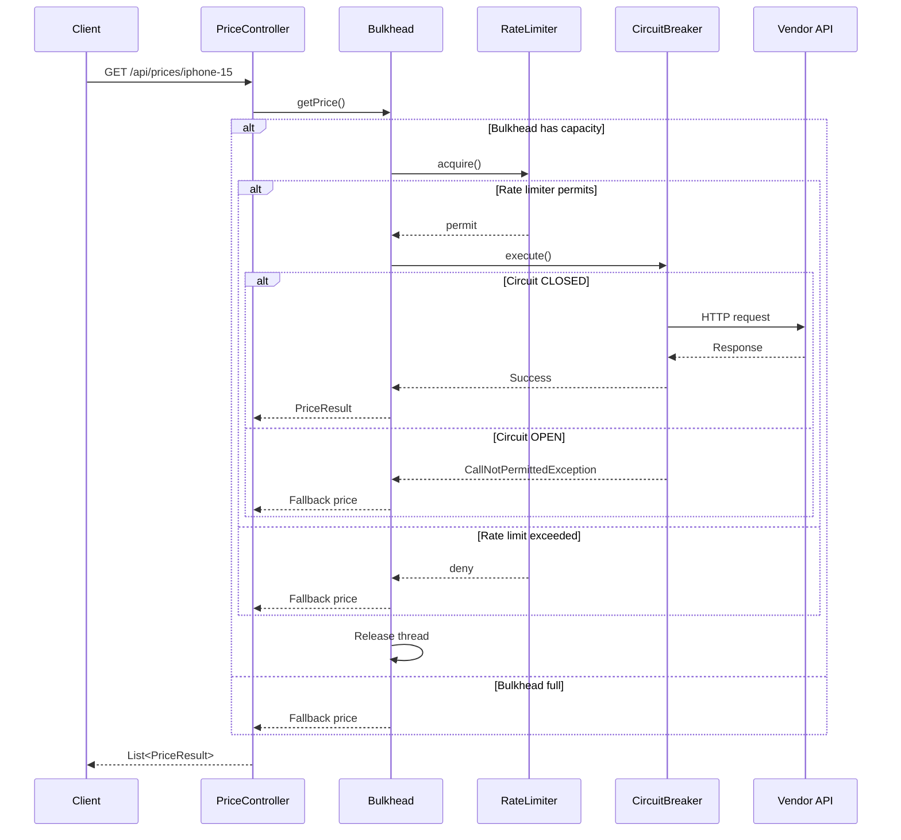

# Building Resilient Microservices with Resilience4j: Circuit Breaker, Bulkhead, Rate Limiter & Timeout

Your price aggregator is working great — until Amazon's API starts timing out, or Flipkart gets overwhelmed and responds slowly to every request. Suddenly, your service is hanging for seconds, threads are piling up, and Walmart calls are affected too.

This is where **Resilience4j** comes in. In this article, I'll show you how to implement four key resilience patterns:

1. **Circuit Breaker** (implemented) — Stop calling failing services
2. **Timeout** (implemented) — Don't wait forever for slow responses
3. **Bulkhead** (planned) — Isolate thread pools per vendor
4. **Rate Limiter** (planned) — Control request rates

Let's dive in!

---

## Why Resilience Matters

In a microservices world, dependencies fail. Your price aggregator depends on 3 vendor APIs:

```
User Request
    ↓
Price Aggregator
    ├── Amazon API (might fail)
    ├── Flipkart API (might be slow)
    └── Walmart API (might be rate-limited)
```

**Without resilience:**
- One slow Amazon call blocks threads → All requests slow down
- Flipkart is down → Every request waits for timeout
- No rate limiting → Vendor bans your API key

**With resilience:**
- Circuit breaker opens → Fail fast, use cache
- Timeout → Don't wait forever
- Bulkhead → One vendor's problems don't affect others
- Rate limiter → Stay within API quotas

---

## 1. Circuit Breaker (Implemented)

### What is a Circuit Breaker?

Think of it like an electrical circuit breaker in your house. When too many calls fail, it "trips" and stops sending requests. After a timeout, it lets a few requests through to test if the service recovered.

### Circuit Breaker States (Mermaid Diagram)



### How It Works in Code

We use **programmatic approach** (not annotations) with `CircuitBreakerRegistry`:

```java
@Component
public class AmazonClient implements PriceAggregator {

    private final CircuitBreaker circuitBreaker;

    public AmazonClient(CircuitBreakerRegistry circuitBreakerRegistry) {
        this.circuitBreaker = circuitBreakerRegistry.circuitBreaker("amazon");
        
        // Listen to circuit events (great for debugging!)
        this.circuitBreaker.getEventPublisher()
            .onStateTransition(event -> log.info("[AMAZON] circuit state transition: {} -> {}",
                event.getStateTransition().getFromState(),
                event.getStateTransition().getToState()))
            .onCallNotPermitted(event -> log.warn("[AMAZON] circuit: call NOT permitted (circuit OPEN)"))
            .onSuccess(event -> log.debug("[AMAZON] circuit: call succeeded"))
            .onError(event -> log.warn("[AMAZON] circuit: call failed - {}", 
                event.getThrowable().getMessage()));
    }
}
```

### Using Circuit Breaker to Wrap API Calls

```java
private PriceResult fetchPriceFromApi(String productId, String traceId, boolean refreshCache) {
    Supplier<PriceResponse> supplier = () -> webClient.get()
            .uri(baseUrl + "/mock-api/amazon/{productId}", productId)
            .retrieve()
            .bodyToMono(PriceResponse.class)
            .timeout(Duration.ofSeconds(3))
            .block();

    try {
        // Circuit breaker wraps the API call
        PriceResponse response = circuitBreaker.executeSupplier(supplier);
        
        if (response != null) {
            cacheService.set(VENDOR, productId, response.getPrice(), response.getTimestamp());
            return PriceResult.fromApi(VENDOR, response.getPrice(), response.getTimestamp(), traceId);
        }
    } catch (Exception e) {
        log.warn("[{}] productId={} API call failed, circuit state: {}", 
                  VENDOR.toUpperCase(), productId, circuitBreaker.getState());
    }

    // Fallback: return cached price or error
    return getFallbackPrice(productId, null, traceId);
}
```

### Circuit Breaker Configuration

```yaml
resilience4j:
  circuitbreaker:
    configs:
      default:
        registerHealthIndicator: true     # Expose to /actuator/health
        slidingWindowSize: 10              # Last 10 calls
        minimumNumberOfCalls: 5              # Need 5 calls before calculating
        permittedNumberOfCallsInHalfOpenState: 3
        automaticTransitionFromOpenToHalfOpenEnabled: true
        waitDurationInOpenState: 5s        # Wait 5s before trying again
        failureRateThreshold: 50            # Open if >50% fail
        slowCallDurationThreshold: 1000ms   # Calls >1s are "slow"
        slowCallRateThreshold: 50            # Open if >50% are slow
        recordExceptions:
          - java.lang.RuntimeException
          - org.springframework.web.reactive.function.client.WebClientResponseException
          - java.util.concurrent.TimeoutException
          - java.net.ConnectException
    instances:
      amazon:
        baseConfig: default
      flipkart:
        baseConfig: default
      walmart:
        baseConfig: default
```

### What Happens When Circuit Opens?



---

## 2. Timeout Handling (Implemented)

### Why Timeout Matters

Without timeout, a slow vendor API can hang your thread indefinitely. We implement timeout at **two levels**:

### Level 1: WebClient Timeout

```java
Supplier<PriceResponse> supplier = () -> webClient.get()
        .uri(baseUrl + "/mock-api/amazon/{productId}", productId)
        .retrieve()
        .bodyToMono(PriceResponse.class)
        .timeout(Duration.ofSeconds(3))  // <-- WebClient timeout
        .block();
```

### Level 2: CompletableFuture Timeout

```java
private CompletableFuture<PriceResult> fetchWithFallback(PriceAggregator client, String productId, boolean refreshCache) {
    return CompletableFuture.supplyAsync(() -> {
            return client.getPrice(productId, refreshCache);
        }, priceTaskExecutor)
            .orTimeout(timeoutMs, TimeUnit.MILLISECONDS)  // <-- Future timeout
            .exceptionally(ex -> {
                log.warn("Failed to fetch price from {}, using fallback", 
                        client.getClass().getSimpleName());
                return client.getFallbackPrice(productId, ex);
            });
}
```

### Timeout Configuration

```yaml
price:
  fetch:
    timeout-ms: 2000    # 2 seconds max per vendor call
```

### Timeout Flow (Mermaid Diagram)



---

## 3. Bulkhead Pattern (Planned for Part 6)

### What is a Bulkhead?

Bulkhead is a maritime term — ships have watertight compartments (bulkheads) so if one floods, the ship doesn't sink. In software, it means **isolating resources** so one component's failure doesn't cascade.

### Why We Need It

Currently, all vendors share the same `priceTaskExecutor` thread pool. If Amazon is slow and consumes all 10 threads, Flipkart and Walmart calls also suffer!

### Planned Architecture (Mermaid Diagram)



### Planned Bulkhead Configuration

```yaml
resilience4j:
  bulkhead:
    instances:
      amazon:
        max-concurrent-calls: 10       # Max 10 concurrent calls
        max-wait-duration: 1000ms       # Wait 1s for available thread
      flipkart:
        max-concurrent-calls: 10
        max-wait-duration: 1000ms
      walmart:
        max-concurrent-calls: 10
        max-wait-duration: 1000ms
```

### Bulkhead + Circuit Breaker Together



---

## 4. Rate Limiter (Planned for Part 6)

### Why Rate Limiting?

Vendor APIs have rate limits (e.g., 100 requests/second). Exceed it, and you get banned or throttled.

### Rate Limiter Configuration (Planned)

```yaml
resilience4j:
  ratelimiter:
    instances:
      amazon:
        limit-for-period: 100          # 100 calls
        limit-refresh-period: 1s         # per second
        timeout-duration: 100ms          # Wait max 100ms for permit
      flipkart:
        limit-for-period: 50
        limit-refresh-period: 1s
        timeout-duration: 100ms
      walmart:
        limit-for-period: 75
        limit-refresh-period: 1s
        timeout-duration: 100ms
```

### Rate Limiter Flow (Mermaid Diagram)



---

## 5. Putting It All Together

### Combined Resilience Flow (Mermaid Diagram)



### Annotations Approach (For Part 6)

While we currently use programmatic approach, Part 6 will explore **Spring Cloud annotations**:

```java
@Service
public class AmazonClient {
    
    // Combine multiple resilience patterns with annotations
    @Bulkhead(name = "amazon", fallbackMethod = "fallback")
    @RateLimiter(name = "amazon")
    @TimeLimiter(name = "amazon")
    @CircuitBreaker(name = "amazon", fallbackMethod = "fallback")
    public CompletableFuture<PriceResult> getPriceAsync(String productId) {
        return CompletableFuture.supplyAsync(() -> {
            // API call here
        });
    }
    
    public CompletableFuture<PriceResult> fallback(String productId, Exception ex) {
        return CompletableFuture.completedFuture(
            PriceResult.error("amazon", "Fallback price", null)
        );
    }
}
```

---

## 6. Monitoring Circuit Breakers

### Health Endpoint

Resilience4j integrates with Spring Boot Actuator:

```bash
# Check all circuit breakers
curl http://localhost:8080/actuator/circuitbreakers

# Check health (includes circuit state)
curl http://localhost:8080/actuator/health
```

### Sample Health Response

```json
{
  "components": {
    "circuitBreakers": {
      "status": "UP",
      "details": {
        "amazon": {
          "status": "UP",
          "details": {
            "state": "CLOSED"
          }
        },
        "flipkart": {
          "status": "UP",
          "details": {
            "state": "HALF_OPEN"
          }
        }
      }
    }
  }
}
```

---

## 7. Testing Resilience with Chaos

We built chaos endpoints to test circuit behavior:

```bash
# Simulate 100% failures (trips circuit immediately)
curl http://localhost:8080/mock-api/chaos/scenario/fast-failures

# Simulate slow responses (>1s threshold)
curl http://localhost:8080/mock-api/chaos/scenario/slow-responses

# Simulate unstable service (70% failures + 3s delay)
curl http://localhost:8080/mock-api/chaos/scenario/unstable

# Reset chaos
curl http://localhost:8080/mock-api/chaos/reset
```

### Testing Script (cb-test.sh)

```bash
./cb-test.sh fast-fail    # Trip circuit with failures
./cb-test.sh slow         # Test slow call threshold
./cb-test.sh unstable     # Trip with unstable service
./cb-test.sh watch        # Real-time monitoring
```

---

## Key Takeaways

✅ **Circuit Breaker** stops calling failing services (implemented)

✅ **Timeout** prevents waiting forever for slow APIs (implemented)

✅ **Bulkhead** isolates thread pools per vendor (coming in Part 6)

✅ **Rate Limiter** stays within API quotas (coming in Part 6)

✅ **Combine them** for maximum resilience

✅ **Monitor** with Actuator health endpoints

✅ **Test** with chaos engineering

---

## Conclusion

Building resilient microservices isn't optional — it's essential. When (not if) your dependencies fail, you'll be glad you have:

1. **Circuit Breaker** to fail fast
2. **Timeout** to not wait forever
3. **Bulkhead** to isolate failures
4. **Rate Limiter** to respect quotas

Resilience4j makes this easy with both **programmatic** and **annotation-based** approaches. Start with what works (programmatic is more predictable), then explore annotations for cleaner code.

In **Part 6** of this project, we'll implement Bulkhead, Rate Limiter, and TimeLimiter using annotations. Stay tuned!

---

## Further Learning

Want to dive deeper? Check out this YouTube playlist for more on Resilience4j, microservices patterns, and distributed tracing:

📺 **[Resilience4j & Microservices Playlist](https://www.youtube.com/playlist?list=YOUR_PLAYLIST_ID)** *(Replace with actual playlist link)*

**Related articles in this series:**
- [Part 1: Building an MDC-Aware Thread Pool](https://github.com/codefarm0/price-aggregator/blob/main/medium-stories/01-thread-pool-mdc-propagation.md)
- Part 6: Completing Resiliency (Bulkhead, TimeLimiter, Retry) — *coming soon*

---

**Full code available at:** [github.com/codefarm0/price-aggregator](https://github.com/codefarm0/price-aggregator)

**Key files:**
- `src/main/java/in/code/farm/price/aggregator/external/AmazonClient.java` — Circuit breaker implementation
- `src/main/java/in/code/farm/price/aggregator/config/PriceConfig.java` — Thread pool config
- `src/main/resources/application.yaml` — Resilience4j configuration
- `src/main/java/in/code/farm/price/aggregator/mock/MockVendorController.java` — Chaos endpoints

---

*If you found this helpful, follow me for more Spring Boot and microservices content!*
